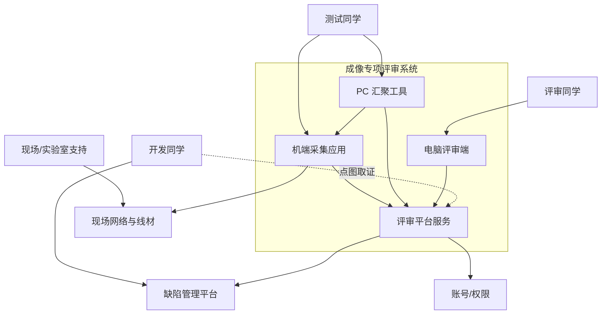
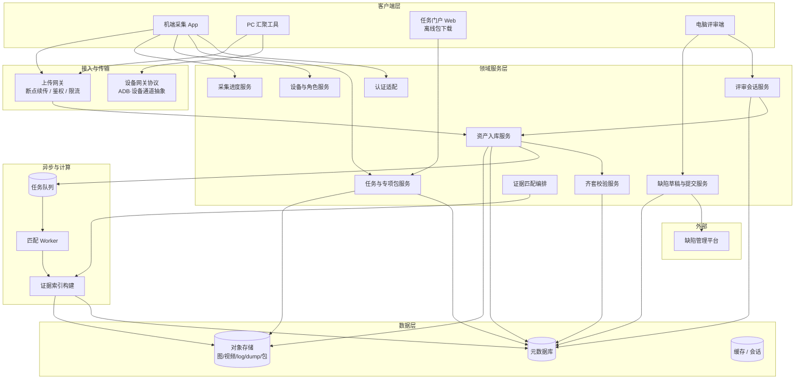
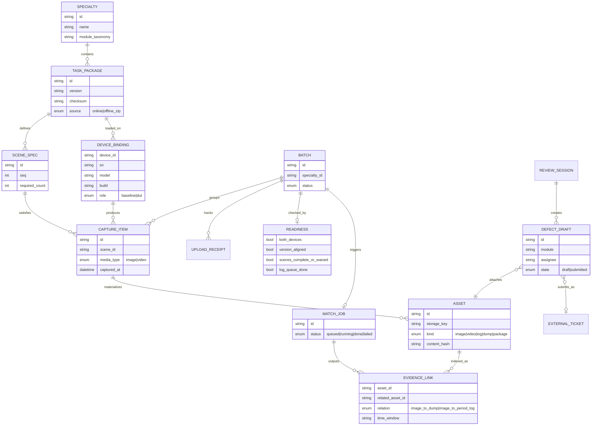
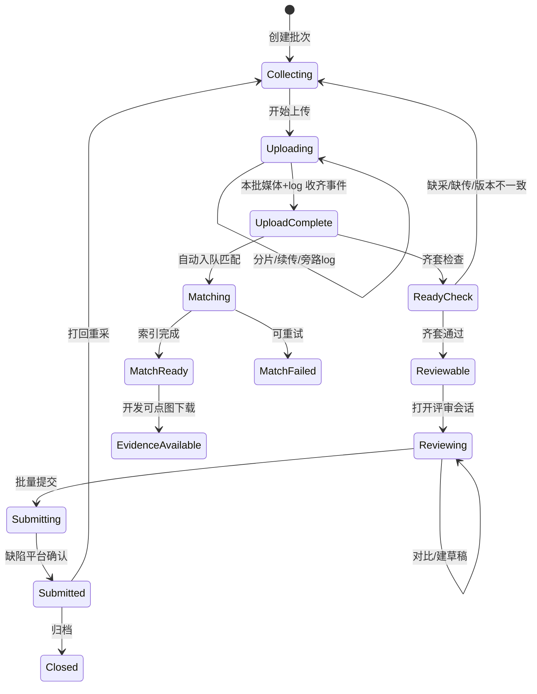
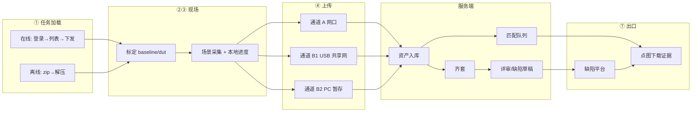
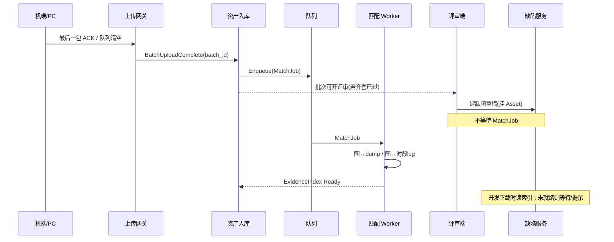
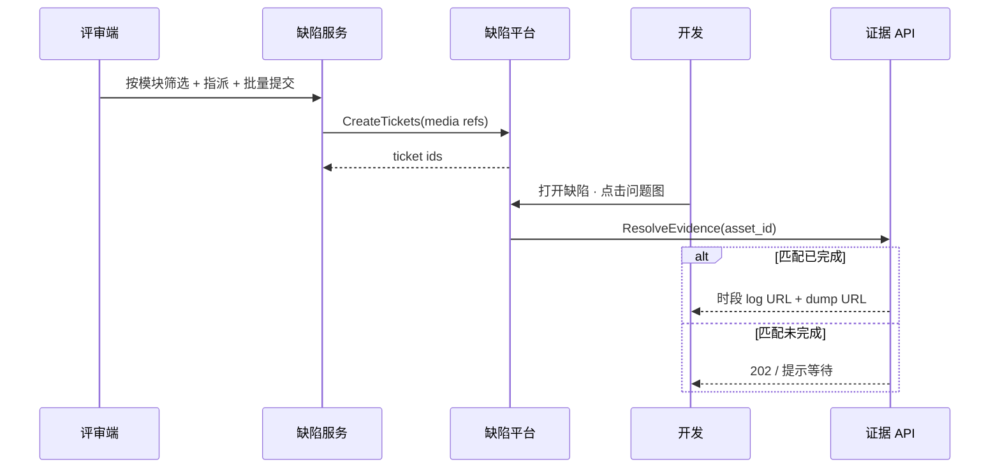
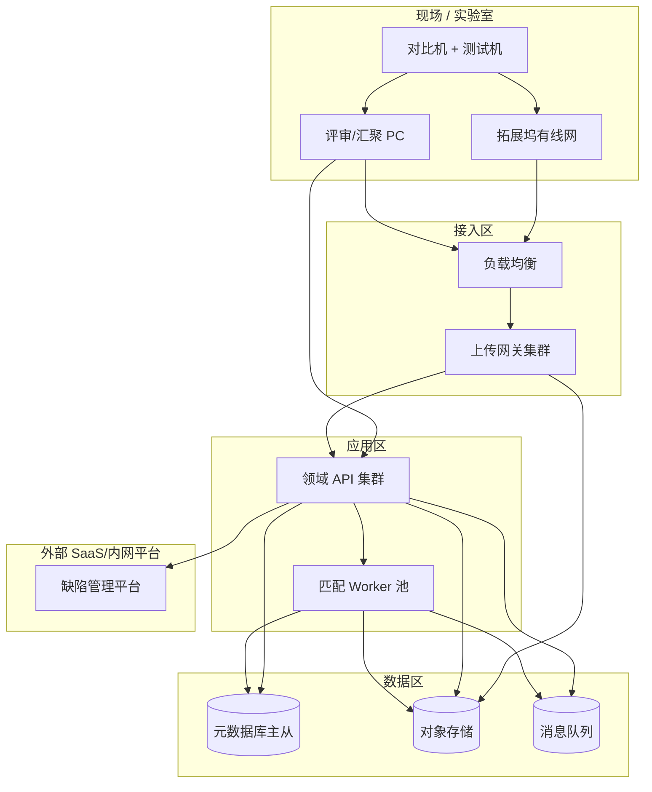

# 成像专项评审系统 · 架构设计

> 依据《成像专项评审流程图》抽象的**领域系统架构**，不绑定任何现有工程实现。  
> 目标：描述「现场采集 → 多通道上传 → 齐套校验 → 批量评审建缺陷 → 后台证据匹配 → 缺陷平台取证」所需的系统边界、组件、数据与关键约束。  
> 日期：2026-07-31  
>  
> **Word：** `docs/REVIEW_PIPELINE_ARCHITECTURE.docx`（含架构图）。  
> 重新生成：`python scripts/export_architecture_docx.py`

---

## 1. 设计目标与边界

### 1.1 要解决的问题

在双机（对比机 / 测试机）成像专项评审中：

1. **任务可达**：有网用在线任务，无网用离线包，机端得到同一套任务卡与场景清单。
2. **现场可采**：按场景采集图片/视频，旁路上传设备日志。
3. **链路可选**：网口直传、USB 共享网直传、PC 暂存再传三种上传路径收敛到同一服务端资产。
4. **齐套可判**：双机、版本、场景、日志齐套后才进入正式评审。
5. **评审可并行**：批量对比与建缺陷不阻塞；证据匹配在上传完成后由服务端后台完成。
6. **开发可取证**：在缺陷平台点问题图即可拉取「时段 log + 对应 dump」。

### 1.2 范围

| 在范围内 | 不在范围内 |
|----------|------------|
| 任务分发 / 离线包 | 手机相机 ISP / 算法训练 |
| 机端采集与上传编排 | 缺陷平台内部工作流引擎实现 |
| 评审对比与缺陷草稿 | 通用 CI / 源码构建系统 |
| 媒体与证据对象存储、匹配 | 组织级账号中心的产品选型细节 |
| 与缺陷平台的对接契约 | 具体 UI 框架、语言、仓库结构 |

### 1.3 设计原则

1. **入口可替换、下游统一**：在线 / 离线只影响「任务包来源」，加载完成后领域模型一致。
2. **通道可替换、落点统一**：A / B1 / B2 只影响传输路径，服务端资产模型一致。
3. **评审与匹配解耦**：匹配由「上传完成」事件触发，不绑在「建缺陷」按钮上。
4. **证据按图寻址**：开发侧以「问题图」为入口拉取关联 dump / log，匹配结果是索引而非拷贝附件。
5. **状态可回退**：齐套失败、通道失败、版本不一致均可回到明确步骤，不静默吞错。

---

## 2. 系统上下文

### 外部依赖契约（摘要）

| 外部系统 | 本系统需要它提供 | 本系统向它提供 |
|----------|------------------|----------------|
| 缺陷管理平台 | 创建缺陷、模块字段、指派人、附件/外链、状态 API | 缺陷标题/描述、模块、指派人、媒体引用、证据下载入口 |
| 账号权限 | Token / SSO、下载鉴权 | 用户身份、操作审计主体 |
| 现场网络 | 可达上传入口的 L2/L3 通路 | 无（消费方） |

---

## 3. 逻辑架构（组件）

### 3.1 组件职责

| 组件 | 职责 | 关键产出 |
|------|------|----------|
| 机端采集 App | 在线/离线加载、标定 baseline/dut、场景采集、发起 A/B1 上传、显示本地进度 | 本地任务卡、本地媒体、上传请求 |
| 任务门户 Web | 浏览专项、导出离线 zip | 离线任务包 |
| PC 汇聚工具 | 设备发现、拉取、命名 album 包、选目录批量上传（B2） | 暂存包、上传批次 |
| 电脑评审端 | 选批次、图/视频对比、建缺陷（自动挂素材）、按模块指派批量提交 | 缺陷草稿、提交批次 |
| 任务与专项包服务 | 任务目录、版本、场景清单、在线下发、离线包签名与校验 | TaskPackage、SceneSpec |
| 设备与角色服务 | 机型/SN/build/ADB 标识、baseline/dut 绑定、双机版本一致性 | DeviceRoleBinding |
| 采集进度服务 | 场景 n/n、总进度、缺项记录 | CaptureProgress |
| 上传网关 | 多协议入口统一、鉴权、分片、幂等、旁路 log 队列 | UploadReceipt |
| 资产入库服务 | 媒体/log/dump 落对象存储、写元数据、关联任务/设备/场景 | Asset、Batch |
| 齐套校验服务 | 双机上传、版本一致、场景齐/认可、log 队列完成 | ReadinessReport |
| 评审会话服务 | 批次视图、对比布局、通过/跳过、问题场景标记 | ReviewSession |
| 缺陷草稿与提交服务 | 自动挂素材、模块归类、指派人、批量推缺陷平台 | DefectDraft → ExternalTicket |
| 证据匹配编排 + Worker | 上传完成后入队；图↔dump、图↔时段 log 等关联 | EvidenceIndex |
| 对象存储 / 元数据库 | 大文件与结构化索引 | 持久化事实源 |

---

## 4. 领域模型（核心实体）

### 4.1 批次状态机（服务端）

要点：**UploadComplete 同时扇出到 Matching 与 ReadyCheck/Review**；Reviewable 不依赖 MatchReady，但 EvidenceAvailable 依赖 MatchReady。

---

## 5. 端到端数据流

### 5.1 上传通道作为架构模式

| 通道 | 拓扑 | 客户端职责 | 服务端视角 |
|------|------|------------|------------|
| **A** | Phone → Dock Ethernet → Upload Gateway | 机端排队上传 + 旁路 log | 直收；无 PC 落盘 |
| **B1** | Phone → USB tethering → Gateway | 同 A；PC 仅网关 | 同 A；元数据可记 `via=tether` |
| **B2** | Phone → Device Gateway → PC Staging → Gateway | PC 负责拉取、命名、批量传 | 收的是「已打包 album」；需校验 SN/机型命名 |

统一约束：

- 入库后 **Asset 模型相同**（kind、hash、scene、device、batch）。
- 上传网关提供 **幂等键**（content_hash + batch_id + device_id）。
- 旁路 log 与主媒体可并行队列，齐套时分别判定。

---

## 6. 关键时序

### 6.1 上传完成 → 后台匹配（不阻塞评审）

### 6.2 缺陷提交与取证

---

## 7. 部署拓扑（逻辑）

### 环境建议

| 环境 | 说明 |
|------|------|
| 现场弱网 | 优先离线包 + B2；上传网关支持断点续传与队列持久化 |
| 实验室有线 | 优先 A；B1 作备用 |
| 多机并行 | B2 适合 PC 侧编排多设备；服务端按 device_id 隔离批次进度 |

---

## 8. 接口与事件（架构级契约）

### 8.1 同步 API（示意）

| 能力 | 方法示意 | 说明 |
|------|----------|------|
| 任务列表/详情 | `GET /tasks` | 在线加载 |
| 下发/重载包 | `POST /tasks/{id}/load` | 机端拉取场景 |
| 离线包 | `GET /tasks/{id}/package.zip` | 门户下载；含 checksum |
| 上传会话 | `POST /uploads/sessions` | 返回分片策略 |
| 分片/完成 | `PUT /uploads/...` · `POST .../complete` | 幂等 |
| 齐套报告 | `GET /batches/{id}/readiness` | 结构化失败原因 |
| 评审对比集 | `GET /batches/{id}/compare` | baseline vs dut 对齐 |
| 缺陷草稿 | `POST /defects` | 自动附 asset_ids |
| 批量提交 | `POST /defects/submit` | 调缺陷平台 |
| 证据解析 | `GET /assets/{id}/evidence` | 依赖匹配索引 |

### 8.2 领域事件

| 事件 | 触发 | 订阅方 |
|------|------|--------|
| `TaskPackageLoaded` | 机端加载成功 | 设备角色、进度 |
| `CaptureProgressUpdated` | 场景拍摄 | 齐套预检、UI |
| `BatchUploadComplete` | 媒体+约定 log 收齐 | 匹配入队、齐套 |
| `ReadinessPassed` | 齐套服务 | 评审端解锁 |
| `MatchJobCompleted` | Worker | 证据 API、通知 |
| `DefectsSubmitted` | 提交服务 | 审计、报表 |

---

## 9. 非功能需求

| 类别 | 要求 |
|------|------|
| 可靠性 | 上传分片可续传；匹配失败可重试；提交缺陷平台失败可重放且幂等 |
| 一致性 | 双机 TaskPackage.version 不一致则不可进入 Reviewable |
| 性能 | 大批量图/视频对比走对象存储直链或 CDN；匹配 Worker 水平扩展 |
| 安全 | 下载证据鉴权；离线包校验 checksum/签名；SN 缺失包拒绝入库（对应异常回退） |
| 可观测 | 批次维度指标：上传剩余、齐套失败原因分布、匹配队列深度、提交成功率 |
| 离线 | 机端在无业务网时可完成加载与采集；上传仍需对应通道可达 |

---

## 10. 与流程图步骤的映射

| 流程步骤 | 架构落点 |
|----------|----------|
| ① 在线/离线加载 | 任务服务 + 机端加载器 +（可选）任务门户 |
| ② 标定角色 | 设备与角色服务 |
| ③ 场景采集 | 机端 + 采集进度服务 |
| ④ A/B1/B2 | 上传网关 +（B2）PC 汇聚 + 设备网关 |
| ⑤ 齐套 | 齐套校验服务 |
| ⑥ 对比建缺陷 | 评审端 + 评审会话 + 缺陷草稿 |
| ⑥c 后台匹配 | 事件 → 队列 → Worker → 证据索引 |
| ⑦ 模块指派提交 | 缺陷提交服务 → 缺陷平台 |
| 开发点图下载 | 证据 API（经缺陷平台深链） |
| 异常回退 | 各服务返回可操作错误码 + 客户端引导回 ①～④ |

---

## 11. 演进与裁剪建议

**MVP（可先落地）**

1. 在线任务 + 单通道上传（A 或 B2 二选一）  
2. 齐套（双机 + 版本 + 场景）  
3. 评审对比 + 缺陷草稿挂图  
4. 提交缺陷平台  
5. 匹配可先做「弱关联 / 人工时段」再换强算法  

**完整形态**

- 三通道齐全、旁路 log 齐套、自动图↔dump/log 匹配、批量模块指派、全链路可观测与审计。

**刻意不做的事**

- 不要把匹配绑在「建缺陷」事务里。  
- 不要让 B1 在 PC 落业务盘（与 B2 职责混淆）。  
- 不要让在线/离线加载产生两套互不兼容的场景模型。

---

## 12. 文档关系

| 文档 | 内容 |
|------|------|
| `REVIEW_PIPELINE_FLOW.md` | 业务操作流程与决策（What / When） |
| **本文** | 系统边界、组件、数据、事件、部署（How 的架构层） |
| 后续可增补 | API OpenAPI、匹配算法设计、威胁模型、容量规划 |

---

*本架构为流程驱动的系统设计蓝图，实现时可替换技术栈，但应保持：统一任务模型、统一资产模型、上传完成触发匹配、评审与匹配并行。*
