# 成像专项评审流程图

> 现场 CIS / 拍照专项：从加载专项包到归档的流程图集合。  
> 日期：2026-07-30  
>  
> **Word 标准流程图：** `docs/REVIEW_PIPELINE_FLOW.docx`（已嵌入 PNG 框图）。  
> 重新生成：`scripts/render_flowcharts.py` → `scripts/export_review_flow_docx.py`

---

## 图 1 · 端到端总流程

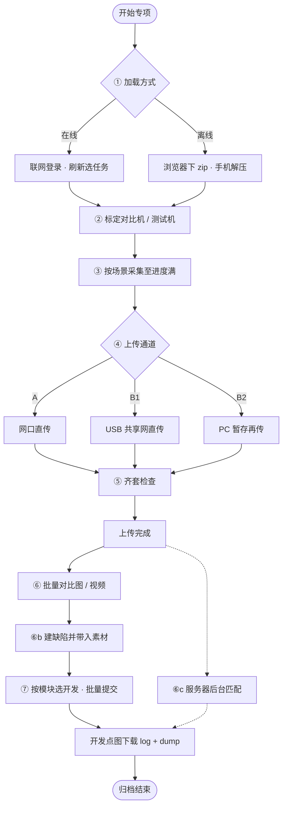

---

## 图 2 · ① 任务加载方式（在线 vs 离线）

任务加载有 **两种入口**，最终都是：机端出现同一套任务卡 + 场景清单。  
**区别只在「任务包从哪来」**，不是采集/上传流程不同。

### 一眼对照

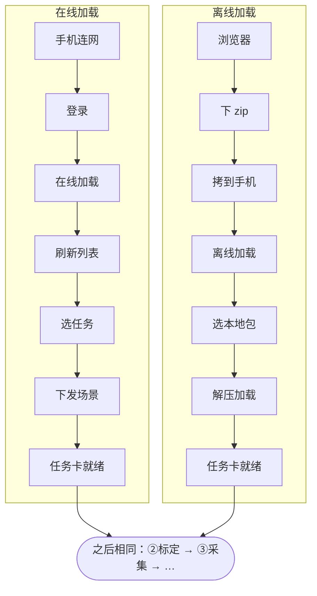

| 对比项 | 在线加载 | 离线加载 |
|--------|----------|----------|
| 要不要现场上网 | **要**（连网 + 登录） | **不要**（加载时可不连业务网） |
| 任务从哪来 | 账号登录后 **刷新列表**，点选任务 | **浏览器先下 zip**，手机本地选包 |
| 关键操作 | 刷新 → 选任务 → 加载/重新加载 | 选压缩包 → **解压** → 加载 |
| 场景怎么进手机 | 选任务后从服务器拉取场景 | 从 zip 解压出场景 |
| 典型场景 | 实验室有网、任务常改 | 外场无网/弱网、任务已预发 |

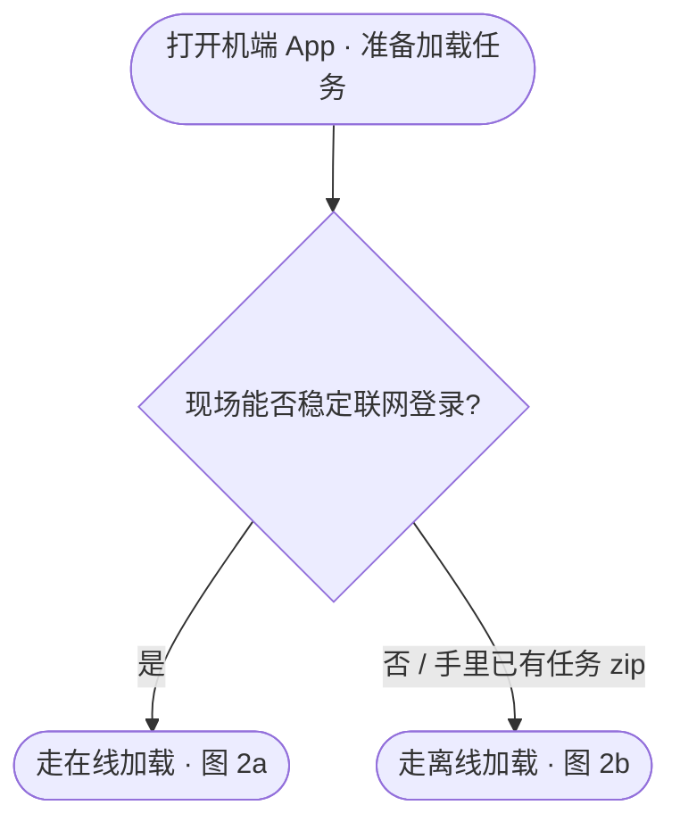

---

## 图 2a · 在线加载（逐步）

> 路径：**网络 → 登录 → 刷新 → 选任务 → 加载场景**

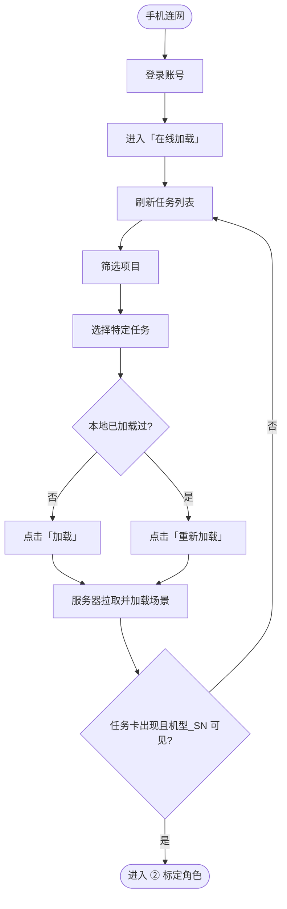

---

## 图 2b · 离线加载（逐步）

> 路径：**浏览器下 zip → 拷到手机 → 选包 → 解压 → 加载场景**  
> （与在线加载的关键差异：不登录刷新列表，而是 **本地解压压缩包**）

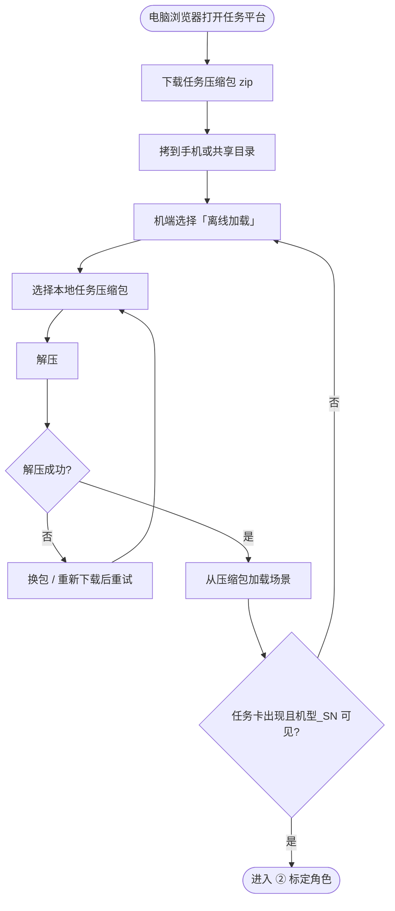

---

## 图 3 · ② 标定设备角色

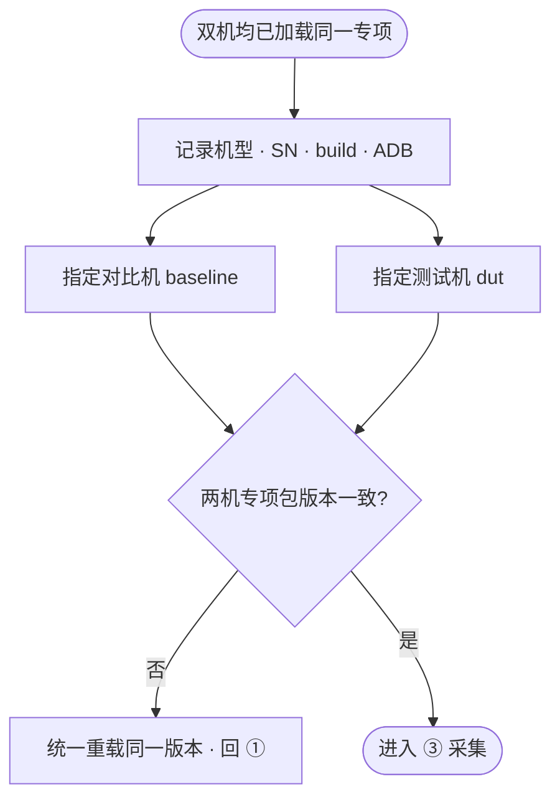

---

## 图 4 · ③ 按场景采集

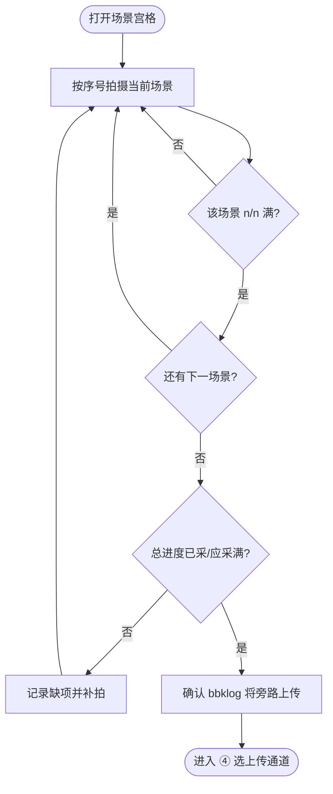

---

## 图 5 · ④ 上传通道决策

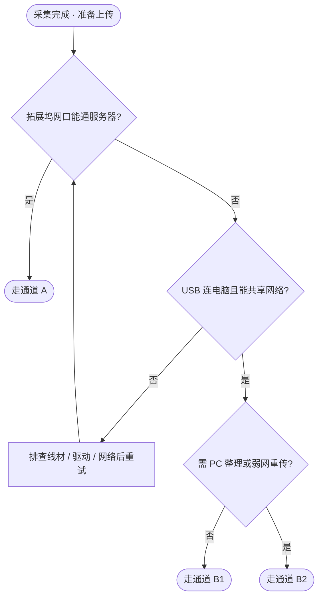

| 通道 | 链路 | 落点 | 谁点上传 |
|------|------|------|----------|
| A | 手机 → 拓展坞以太网 → 服务器 | 直达服务器 | 机端 App |
| B1 | 手机 ↔ USB ↔ PC 共享网 → 服务器 | 不落 PC 盘 | 机端 App |
| B2 | 手机 → ADB/panda → PC → 服务器 | 先落 PC 再传 | PC 工具 |

---

## 图 6 · 通道 A：拓展坞网口直连

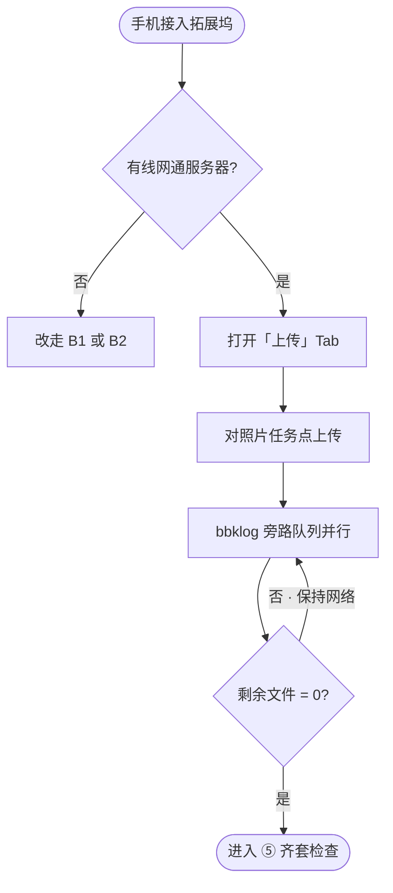

---

## 图 7 · 通道 B1：USB 共享网直传

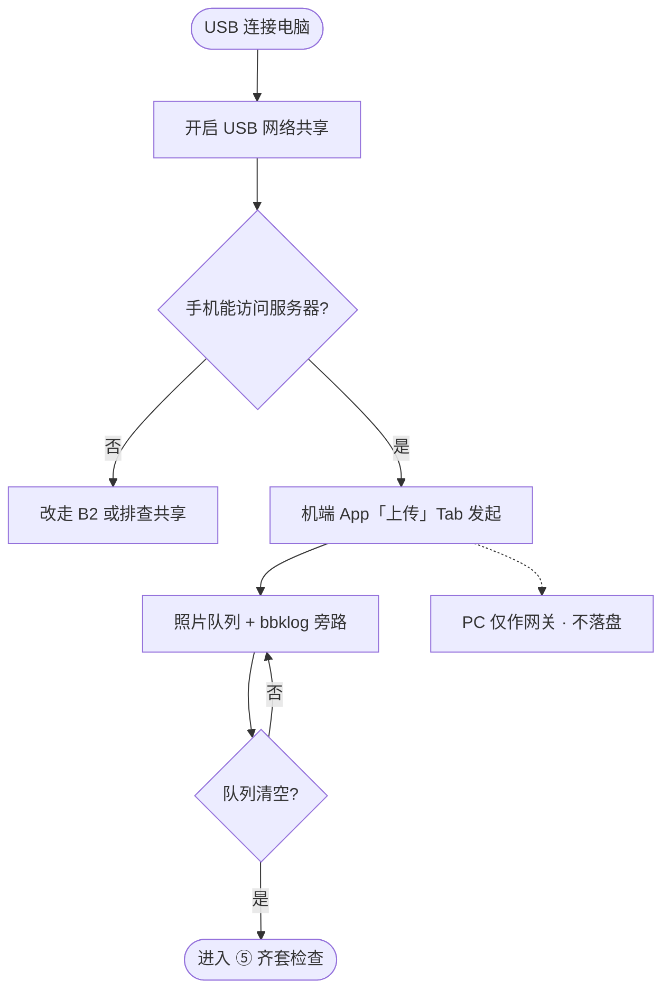

---

## 图 8 · 通道 B2：拉取暂存再上传

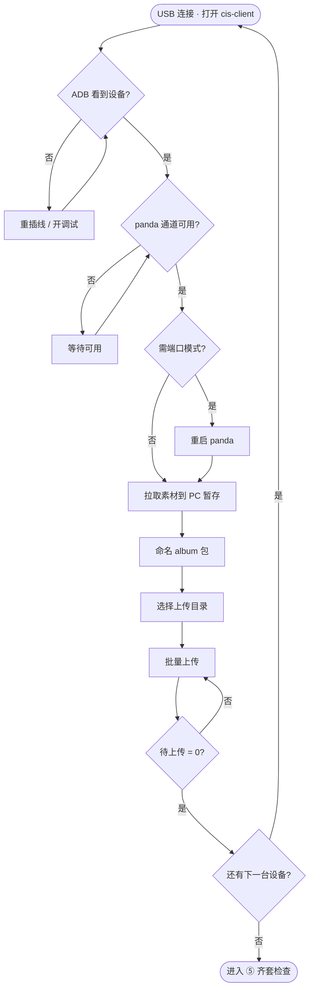

---

## 图 9 · 通道对照（数据落点）

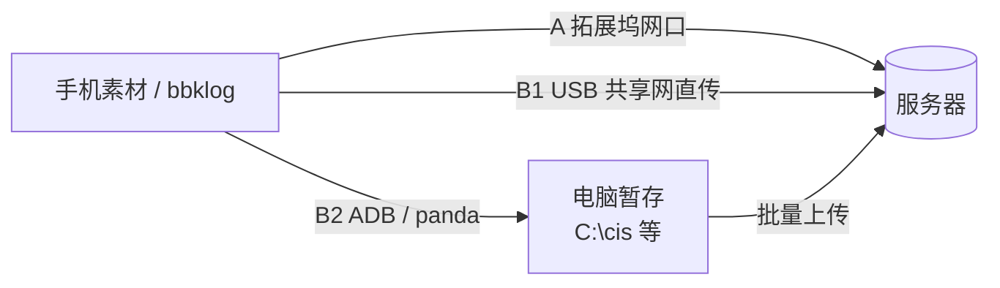

---

## 图 10 · ⑤ 素材齐套检查

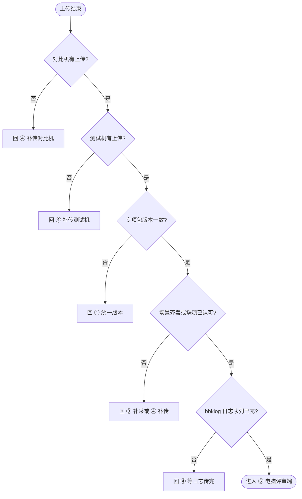

---

## 图 11 · ⑥ 电脑评审端：批量对比 → 建缺陷

> 齐套后进入 **电脑评审端**：可批量对比图片、视频；对有问题的场景建缺陷，缺陷自动带入对应图片/视频。

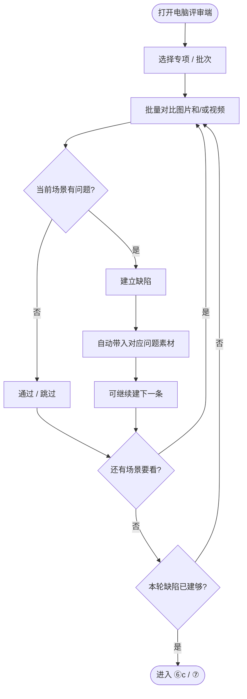

要点：

- 支持 **图片批量对比**、**视频批量对比**（可同一会话内穿插）。
- 建缺陷时系统 **自动挂载** 当前问题素材（图或视频），无需手工再贴附件。
- 可先建一部分缺陷再提交，也可全部建完再提交。

---

## 图 11b · ⑥c 服务器后台匹配（数据上传完成后触发）

> **触发时机：** 本批图片 / 视频 / log / dump 等 **数据全部上传完成后**。  
> **执行方式：** 由 **服务器在后台自动跑**，不占用电脑评审端操作；与「建缺陷 / 批量对比」并行，**不阻塞评审**。  
> **作用：** 把问题图与对应 dump、时段 log 等数据关联，供开发点图下载。

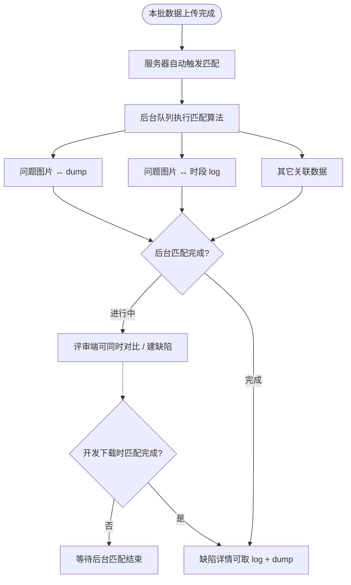

说明：

1. 匹配 **不是** 建缺陷时才触发，而是 **上传完成后服务器后台跑**。  
2. 评审同学可边对比、边建缺陷；开发下载 dump/log 时才必须等匹配就绪。  
3. 若匹配迟迟未完成：查本批是否上传齐套、后台队列是否积压。

---

## 图 12 · ⑦ 按模块指派开发并批量提交

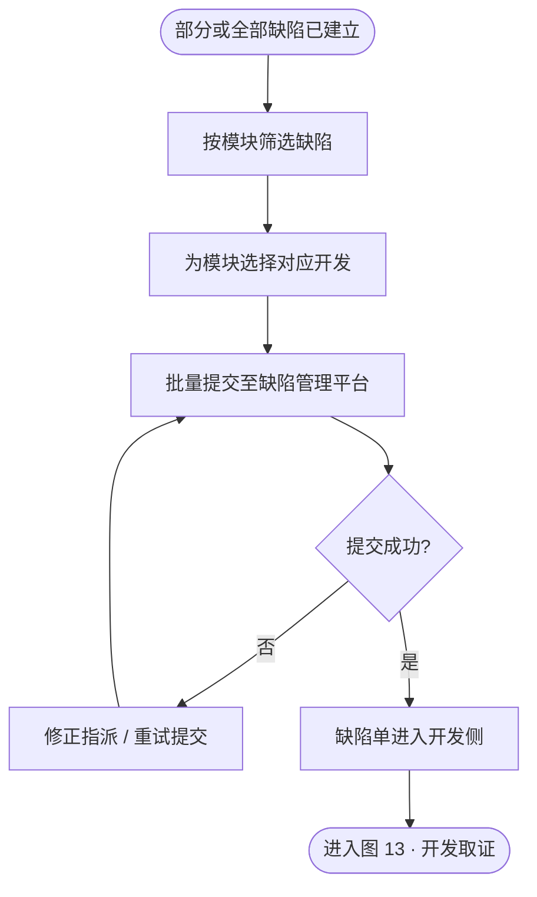

| 步骤 | 操作 |
|------|------|
| 选模块 | 按成像模块（如 LivePhoto、人像、夜景等）归类缺陷 |
| 选开发 | 每个模块指定对应开发负责人 |
| 批量提交 | 一次把本批问题缺陷推到缺陷管理平台 |

---

## 图 13 · 开发取证：点图下载 log + dump

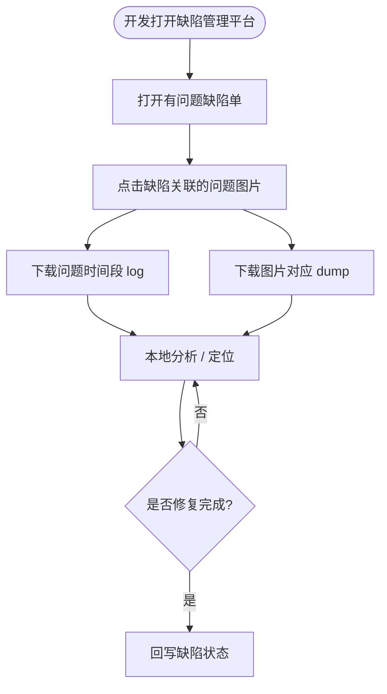

开发侧关键能力：**点问题图即可拉取「该问题时段的 log」+「该图对应的 dump」**（依赖图 11b 匹配结果）。

---

## 图 14 · 异常回退

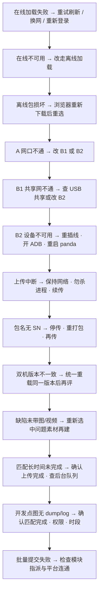

---

## 图 15 · 角色分工泳道

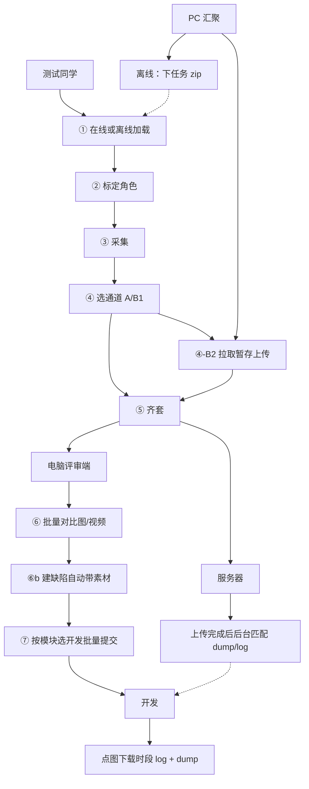

---

在支持 Mermaid 的预览（GitHub / VS Code Markdown 预览）中打开本文件即可查看全部流程图。
